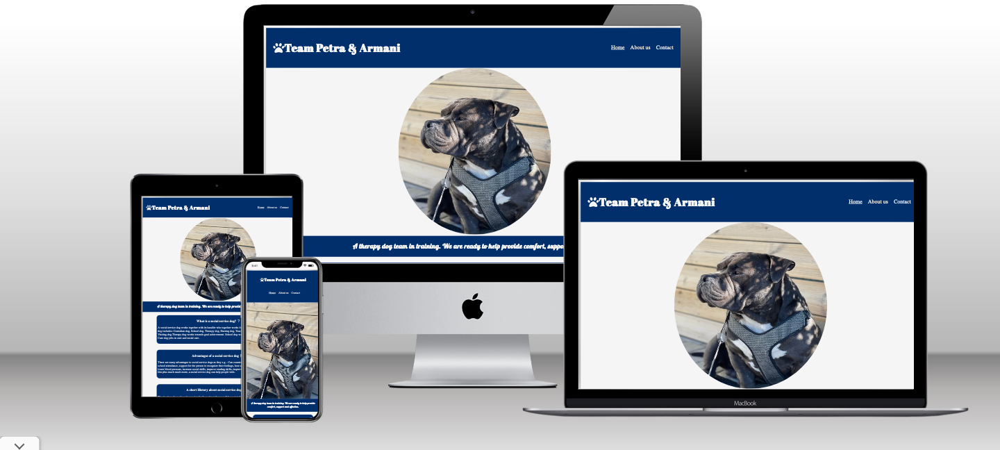
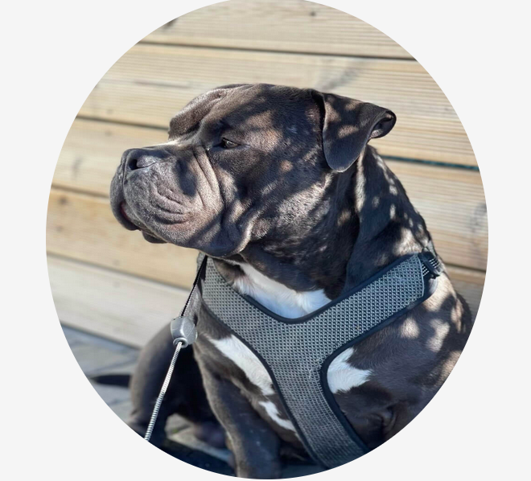
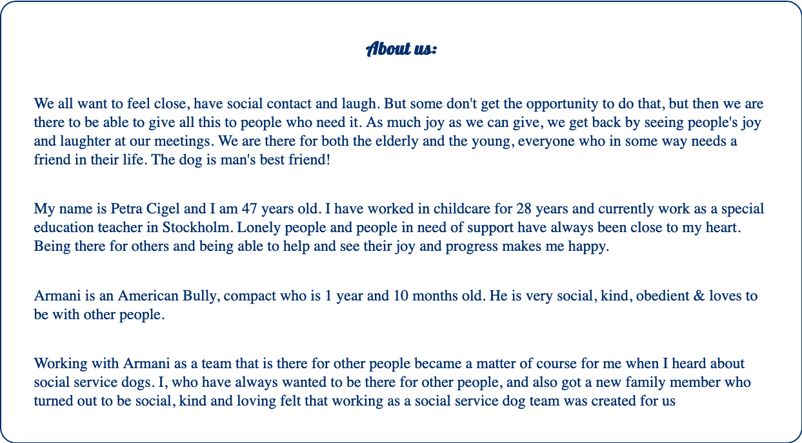
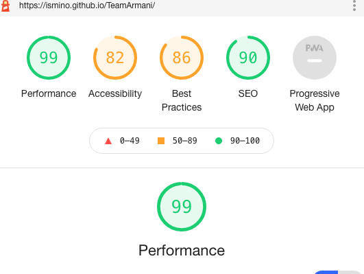
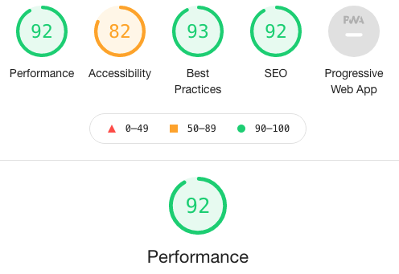

(Inget ämne)

Översätt meddelandet till: Svenska | Översätt aldrig från: Engelska
denise linder
Du
## Features
The Team Petra & Armani webpage is a page for professional use who need a therapy dog. The user's can be school's and hospital's, even retirement home's. The website provides a contact to a service dog and he's owner/leader. The user can also read a little bit about what a social service dog is and what his working with.

### Existing Features

- __Navigation bar__

  - The navigation bar makes the site easy to go throught.
  - The navigation bar is also simple and elegant styled so that the user easy can read.

- __The landing page image__

  - A picture of the social service dog that the team provides.

- __Short intro section__

  - This section helps the user get a clue of what's comming.
 

- __What is a social service dog section__

  - This section helps the user understand what's an social service dog is and about the history of it.
 

- __The Footer__ 

  - This section contains a link to the instagram acount of Team Petra & Armani.

- __About us page__

  - About us is a page where the user's read all about the Team Petra & Armani.
 

- __Contact Page__

  - The side contains a contact fill in where the user can leave a message to the team leader.

## Testing

- I tested the site with lighthouse both for mobile phones and for desktops and the result got very great. It works really great one both smartphones and desktops.
- I also tested to use the site on a smartphone and a desktop and a bigger screen desktop.I found it easy to use on all direrent screens.

### Validator tesing

- There where to small things that came up in the validator testing on w3c html testing. Thhe first is that the img dont have an alt atribute and the secound is that the image dont have an heading. [W3C validator](https://validator.w3.org/nu/?doc=https%3A%2F%2Fismino.github.io%2FTeamArmani%2F)
- Testing trought the jigsaw css validator testing the program did'nt found any errors.[jigsaw validator](https://jigsaw.w3.org/css-validator/validator?uri=https%3A%2F%2Fismino.github.io%2FTeamArmani%2F&profile=css3svg&usermedium=all&warning=1&vextwarning=&lang=sv)

### Unfixed bugs
- the only bug that I have is that the hero picture is bigger than it's sized and it's makes the picture a little bit compressed.

## Deployment
- To deploy my project I want to github and to the teamArmani repositry, from there i went to settings and to pages.
- From pages I deployed my site to main branches and it went online.

https://ismino.github.io/TeamArmani/

## Credits
I've got stuck with the hero picture where i got help from student tutoring, they helped me understand how to put the picture but at the and I changed it all anyway. I also had an issue with the padding that my mentor helped me out with. The pictures are from my mother Petra Cigel and it's her dog. To the media section i googled how to make it and then i tested different things.

## Content
- The text for the pages where written by my mother who has a certificate in ocial service's dog's.
- The pictures was taken by my sister and sent to me from my mother.
- The icons was taken from font awsome. [font awsome](https://fontawesome.com/)
- For making my contact fill in i looked at basic form functions on w3cschool.